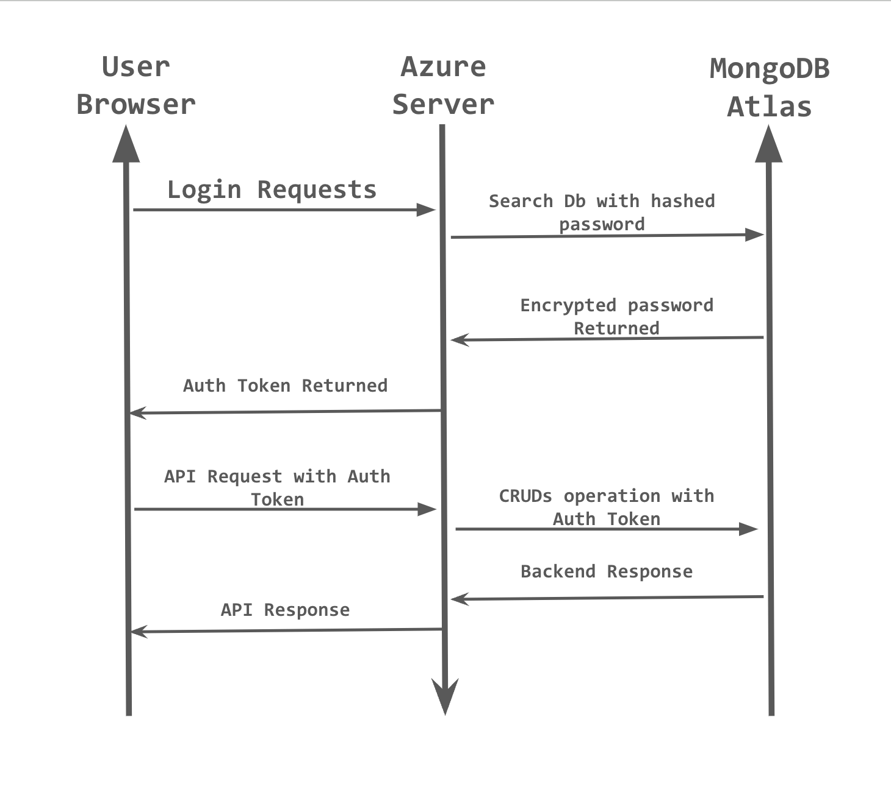
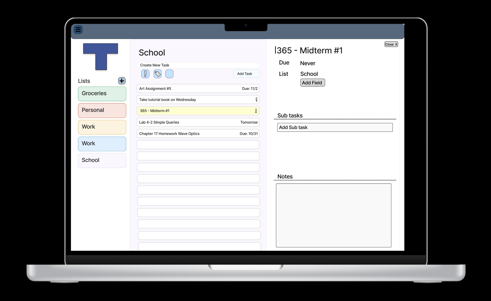
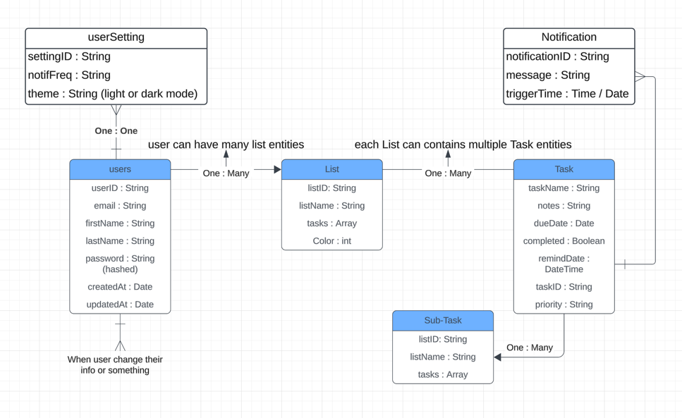

# TaskO
A task creation website that allows you to log into the website and create your own task. What is unique about our app is that it allows you to create sub task and notes to give your task a description and extra sub tasks. We implemented a notification system that sends out a notification through email that updates the user if a task due date is coming up.

## Links to Frontend & Backend Azure Websites

Frontend: https://icy-tree-0490b4d1e.4.azurestaticapps.net/     
Backend Api: https://tasko-api.azurewebsites.net/

## Project Documentation
Sprint Backlogs with Task Estimate vs. Actual Effort

https://github.com/users/abel-alcala/projects/3

## Auth Sequence Diagram
Sequence of requests made in order to securely get/manipulate database data with JWT tokens.

Last updated: 12/03/2024

## Figma Prototype

Original UI design for TaskO prototyped in Figma. Click image to view prototype:

## UML Class Diagram
Class Diagram for TaskO modeled in Lucid. Click image to view full diagram on Lucid site.

Last updated: 11/29/2024

## How to Contribute to TaskO
Want to add any of your own features? Follow these steps to contribute to the project:
1. **Fork the repository** and clone it onto your computer.
2. **Create a new branch** for your changes using: `git checkout -b my-feature`.
3. **Install all node packages** for all required packages: `npm install` in root directory.
4. **Check `package.json` for scripts** to run code, use `npm run dev` in root directory.
5. **Implement your features** and create associated testcases.
6. **Commit your changes**: `git commit -am 'Adding my features'`.
7. **Push to the branch**: `git push origin my-feature`.
8. **Submit a pull request**.